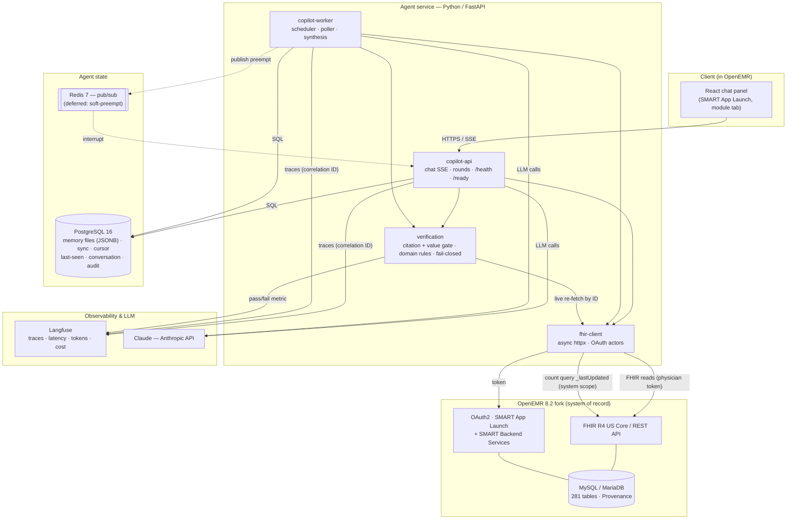

# Clinical Co-Pilot — System Architecture Specification

Audience: a downstream build agent implementing this system, **and** the author presenting/
defending it. Traces back to `USERS.md` (use cases UC-1…UC-7) and `AUDIT.md` (findings).

---

## High-level architecture summary (~500 words)

The Clinical Co-Pilot is a **conversational agent embedded in OpenEMR** that helps a
hospitalist prep and round on ~12 patients, presenting them one at a time by acuity, grounded
in each patient's actual record. The system is a **separate Python service** alongside the
OpenEMR fork, not a modification of the monolith. This is the keystone decision: the agent
reads patient data **exclusively through OpenEMR's FHIR/REST API**, using two OAuth actors —
**SMART App Launch** (physician-delegated token) for interactive chat, so OpenEMR itself
enforces what the physician may see, and **SMART Backend Services** (`client_credentials`,
`system/*.read`) for the background poller, a legitimate scoped system actor. The result is a
crisp trust boundary: **no read path bypasses OpenEMR's authorization.**

A **background poller** runs every 5–15 minutes. For each patient on an active rounding list it
issues a cheap FHIR `_lastUpdated` **count query** to detect change; only changed charts are
pulled, content-hashed to confirm the change is material, and re-synthesized by Claude into a
**memory file**. Memory files are the central persisted artifact: a summary plus, for every
fact, a **provenance pointer** (FHIR resource type + ID + that resource's `lastUpdated`). This
makes grounding two-layered — the file is faithful to source at synthesis time, and each served
answer is re-checkable against source at serve time. Cost and latency therefore scale with the
**change rate**, not patient-count × poll-frequency.

Every agent output — both memory-file synthesis and chat answers — passes through a shared
**verification layer** that **fails closed**. A deterministic gate requires each claim to carry
a valid source reference and requires every number/dose/med name to **exactly match** the cited
record; an optional LLM entailment pass catches narrative drift. A curated **domain-rule** set
(allergy–medication conflict, abnormal/critical labs via the record's `range`/`abnormal` flags,
a small dosage/interaction table) both blocks violations and injects mandatory safety warnings.
Unverifiable claims are withheld or downgraded; a fully unverifiable answer degrades to "I can't
confirm this — here's the source." Because the gate is deterministic, a prompt injection hidden
in a note field can steer the generator but **cannot talk its way past verification**.

State lives in an **encrypted Postgres** database owned by the agent: memory files (JSONB +
provenance refs), sync bookkeeping (per-patient watermark + hash), per-clinician "last-seen"
markers (set by the physician's "done" signal), the rounding cursor, and conversation history.
The **soft-preempt** behavior (UC-5) — interrupting to flag a deteriorating not-yet-seen patient
— is delivered via Redis pub/sub, deferred until after the MVP.

The UI is a **React chat panel launched via SMART App Launch as an in-context OpenEMR module
tab**, streaming over SSE. **Langfuse** provides observability with a correlation ID threaded
through every LLM call, tool call, verification step, and log line; dashboards track request/
error/latency/tool-call/retry/verification-pass-fail/staleness, with alerts on p95 latency,
error rate, tool-failure rate, and **poller staleness** — the last guarding the system's
sharpest failure mode: a physician trusting a stale picture. The whole stack deploys as
docker-compose containers on the **same infrastructure** as OpenEMR behind a TLS reverse proxy,
with a clear path to orchestrated scale-out.

---

## Design principles & constraints

1. **Deterministic core, AI at the edges.** The trust-bearing decisions (authorization,
   verification pass/fail, ranking thresholds, staleness) are deterministic code. The LLM
   synthesizes and converses; it never *is* the security or safety control.
2. **No read path bypasses OpenEMR authorization.** Chat reads as the physician; the poller is
   a scoped system actor; broad read is re-authorized at serve time before any disclosure.
3. **Grounding is two-layered and fails closed.** Faithful-to-source at synthesis; re-checkable
   at serve. Unverifiable → withheld, never asserted.
4. **Integrate with the grain, not against it.** Use FHIR/REST + the Services layer's concepts;
   never query the 281-table schema raw. Separate service, not a monolith fork.
5. **Cost scales with change, not with patients × frequency.** Cheap change-gate before any LLM
   call; hash-confirm before regeneration.
6. **Demo data only; HIPAA posture throughout.** Encryption at rest + TLS; PHI never in logs;
   assume a signed BAA + no-training guarantee with the LLM provider.
7. **Hard constraint (from brief):** deploy the agent to the **same infrastructure** as the
   OpenEMR fork; expose separate `/health` and `/ready`; produce a runnable API collection.
8. **Language reality:** Python service + React frontend (a standard split). Claude is the model.

---

## Components

- **`copilot-api` (FastAPI service).** Public surface for the chat UI. Owns: chat endpoint
  (SSE streaming), rounding-list/cursor endpoints, `/health`, `/ready`. Runs the agent loop
  (Pydantic AI + Anthropic SDK) for interactive drill-down. Does **not** own change detection.
- **`copilot-worker` (scheduler + poller).** Owns the 5–15 min detection tick, change-gating,
  memory-file synthesis, ranking, and enqueuing preempt events. MVP: in-process asyncio task
  in `copilot-api` via FastAPI lifespan. Production: separate process, Postgres-backed job
  queue. Does **not** serve user traffic.
- **`verification` (shared library).** Used by both API and worker. Owns: the deterministic
  citation + numeric exact-match gate, the optional entailment pass, and the domain-rule
  checks. Produces a structured `VerificationResult`. Owns no I/O beyond re-fetching cited
  resources by ID.
- **`fhir-client` (shared library).** Async FHIR/REST client (`httpx`). Owns token acquisition
  for both OAuth actors, resource fetches, and `_lastUpdated`/`_count` change queries. The
  single place that talks to OpenEMR.
- **`memory-store` (repository over Postgres).** Owns persistence of memory files, sync
  bookkeeping, last-seen markers, rounding cursor, conversation state. Everything else uses
  this interface, never raw SQL, so the store is swappable.
- **`copilot-web` (React SPA).** The chat panel, launched in-context via SMART App Launch and
  embedded as an OpenEMR module tab. Owns: chat rendering, SSE consumption, "done"/advance
  controls, freshness display, preempt prompts.
- **OpenEMR fork (unmodified except a thin launch module).** System of record for all clinical
  data; authorization authority for chat; issuer of OAuth tokens.

---

## Tech stack (with versions — pin exact versions in lockfiles)

| Layer | Choice | Version / note |
|-------|--------|----------------|
| Agent runtime | **Python** | 3.12 |
| Web framework | **FastAPI** | ≥0.115 (async; auto-OpenAPI → API collection; native `/health` `/ready`) |
| Contracts | **Pydantic** | v2 (≥2.9) — source of truth for all tool I/O + FHIR shapes |
| Agent loop | **Pydantic AI** | pin exact (young/fast-moving); thin, type-safe, Anthropic-native |
| Model SDK | **anthropic** (Python) | ≥0.40; **Claude** (Sonnet-class for synthesis/chat; a cheaper/faster tier for lightweight classification/gating steps) |
| HTTP | **httpx** | ≥0.27 (async client for concurrent FHIR fan-out) |
| Agent datastore | **PostgreSQL** | 16 (JSONB memory files + relational state; encrypted at rest) |
| ORM/migrations | **SQLAlchemy 2.x** + **Alembic** | for the agent's own schema |
| Scheduler/queue | **APScheduler** 3.x (MVP) → **Procrastinate** (Postgres-backed queue, prod) | keeps Redis deferred |
| Hot path / pub-sub | **Redis** 7 | **deferred** — only when wiring soft-preempt (UC-5) |
| Observability | **Langfuse** (Python SDK) | traces, latency, tokens, cost; + Prometheus-style infra metrics |
| Eval | **pytest** | deterministic asserts + LLM-judge cases; CI-integrated |
| Load test | **Locust** or **k6** | 10 & 50 concurrent scenarios |
| Frontend | **React** 18 + **Vite** + **TypeScript** 5 | SMART App Launch in-context |
| Packaging | **uv** or **pip-tools** | committed lockfile; `pip-audit` in CI |
| Deploy | **Docker Compose** → orchestrated (ECS/EKS) | behind **Caddy**/**Traefik** for TLS |
| CI/CD | **GitHub Actions** | build + test + eval on push |
| — pinned by fork — | OpenEMR **8.2.0-dev**, PHP 8.2, MySQL/MariaDB, FHIR **R4 US Core 3.1.0**, `league/oauth2-server ^8.4` | not modified |

## Data model (agent-owned Postgres)

- **`memory_file`** — `patient_id` (OpenEMR), `summary` (JSONB: list of claim objects, each
  `{text, source_ref:{resource_type, resource_id, field, value}, last_updated}`), `acuity_score`,
  `rank_reason`, `synthesized_at`, `source_watermark` (max `meta.lastUpdated` seen),
  `content_hash`, `stale` (bool). One row per patient.
- **`sync_state`** — `patient_id`, `last_polled_at`, `last_success_at`, `watermark`,
  `content_hash`, `consecutive_failures`. Hot, written every tick.
- **`last_seen`** — `clinician_id`, `patient_id`, `seen_at`. Set by the "done" signal (UC-3);
  powers "since you last saw them" (UC-1).
- **`rounding_cursor`** — `clinician_id`, `ordered_patient_ids` (JSONB), `current_index`,
  `completed_ids` (JSONB), `updated_at`. Survives refresh/crash (UC-3).
- **`conversation`** / **`message`** — `clinician_id`, `patient_id`, `correlation_id`, role,
  content, `created_at`. PHI; retention-policy-bound.
- **`audit_log`** — append-only: `correlation_id`, `clinician_id`, `patient_id`, `action`,
  `resources_returned` (IDs only), `at`. HIPAA access trail.

> All PHI columns encrypted at rest; conversation/memory carry a TTL for retention. Memory files
> are **derived/regenerable** from OpenEMR — treat as rebuildable, not precious.

## Interfaces & contracts (sketched — the build agent should firm these up in Pydantic/Zod)

**Agent HTTP API (FastAPI):**
- `POST /v1/rounds/start` → `{clinician_id}` ⇒ builds/loads cursor, returns first patient card.
- `GET  /v1/rounds/current` ⇒ current patient card `{patient_id, summary_claims[], changes_since_last_seen[], acuity, rank_reason, freshness:{as_of, age_seconds, stale}}`.
- `POST /v1/rounds/advance` → `{clinician_id, completed_patient_id}` ⇒ sets `last_seen`, returns next card.
- `POST /v1/chat` (SSE) → `{clinician_id, patient_id, message, correlation_id?}` ⇒ streamed grounded answer; each claim carries `source_ref`.
- `GET  /v1/rounds/alerts` (MVP poll; later push) ⇒ pending soft-preempt offers.
- `GET  /health` ⇒ process liveness only.
- `GET  /ready` ⇒ validates reachability of **OpenEMR (FHIR), the LLM provider, Langfuse, and Postgres** — not an unconditional 200.

**Tool contracts (Pydantic v2; every tool has strict input+output schemas — contracts are the source of truth, not the implementation):**
- `get_patient_summary(patient_id) -> PatientSummary`
- `get_labs(patient_id, since?) -> list[LabResult{value, units, range, abnormal, source_ref}]`
- `get_medications(patient_id) -> MedList{items[], source, conflicts[]}` (reconciles `lists` vs `prescriptions`)
- `get_conditions / get_vitals / get_encounters / get_allergies(patient_id) -> …`
- Each output field that is a clinical value carries a `source_ref`.

**`VerificationResult`:** `{passed: bool, claims:[{text, source_ref, attribution_ok, value_match, entailment?}], domain_flags:[{rule, severity, message, must_surface}], action: served|withheld|degraded}`.

**FHIR change query (poller):** `GET {fhir}/{Resource}?patient={id}&_lastUpdated=gt{watermark}&_summary=count` per relevant resource type; nonzero count ⇒ pull + hash + maybe synthesize.

**OAuth:** chat = SMART App Launch (authorization-code, `user/*.read` or `patient/*.read`);
poller = SMART Backend Services (`client_credentials`, minimal `system/{Resource}.read` set).

## Data flow

**Background update (UC-1, UC-5):** worker tick → for each active-list patient, `fhir-client`
count query with watermark → if changed, pull changed resources → hash; if hash moved, Claude
synthesizes memory file → `verification` runs at synthesis → persist via `memory-store` →
recompute acuity/rank → if a not-yet-seen patient crosses the deterioration threshold, publish a
preempt offer.

**Interactive drill-down (UC-2, UC-4, UC-7):** UI (SSE) → `copilot-api` resolves physician
token (SMART App Launch) and authorizes patient (serve-time re-check, UC-6) → agent loop plans
tool calls → `fhir-client` fetches (as physician) → Claude drafts answer with `source_ref`s →
`verification` re-checks each claim against memory file **and live-refetches cited resources by
ID** for numeric/critical values → passed claims stream to UI; failed claims withheld/degraded →
everything logged under the correlation ID to Langfuse + `audit_log`.

**Advance (UC-3):** "done" → set `last_seen` → cursor advances → present next card.

## Security (implementable requirements)

- **AuthN/Z:** chat uses short-lived **physician-delegated** tokens (SMART App Launch);
  OpenEMR is the authorization authority. Poller uses a **`system/*.read`** client-credentials
  grant scoped to the minimum resource types. **Serve-time re-check:** before any memory file
  or answer is returned, confirm the requesting clinician is authorized for that patient
  (rounding-list/care-team membership); else refuse (UC-6). Broad read never becomes broad
  disclosure.
- **Data at rest / in transit:** TLS on every hop (UI↔API, API↔OpenEMR, API↔Postgres,
  API↔LLM). Postgres encrypted at rest; PHI columns encrypted; **no PHI in URL params**.
- **Secrets:** poller client secret + LLM API key in a secrets manager / injected env; never in
  code, images, or logs. Lockfile + `pip-audit`/`npm audit` in CI for supply chain.
- **Logging:** PHI never logged. Logs carry IDs + correlation ID only. Append-only `audit_log`
  records access.
- **Prompt-injection containment:** retrieved PHI is always **data**, never instructions —
  strict system/user/tool-result role separation. The deterministic verification gate is
  **not promptable**: a claim injected via a note field still fails attribution/value-match and
  is withheld. This is the architectural answer, not a prompt plea.
- **Tenancy/isolation:** conversation + tool calls are patient-scoped; a chat about patient A
  cannot fetch patient B. Cursor/state keyed by clinician.
- **iframe embedding:** CSP `frame-ancestors` limited to the OpenEMR origin; SMART launch
  handles token/patient-context exchange.

## Rationale & alternatives considered (per decision area — do not silently reverse these)

1. **Integration = separate service via API (Option A).** *Chosen* over an in-process PHP
   module (fights the toolchain; legacy GACL authz; awkward long-running poller) and over a
   hybrid direct-DB path (a second data path + a broad PHI-read surface to secure). API-only
   gives platform-enforced authz and fits Python/Claude. *Reversal cost:* low — the poller's
   fetch sits behind a `ChangeDetector`/`fhir-client` interface; if FHIR latency/completeness
   disappoints, add a DB fast-path **for the poller only** without touching agent/verification.
2. **Runtime = Python / FastAPI / Pydantic AI.** *Chosen* over TypeScript because Pydantic
   (contracts), Langfuse (obs), and the eval ecosystem are strongest in Python. Loop kept in
   thin Pydantic AI (not LangGraph) so **verification stays first-class code we own**. *Reversal
   cost:* low — the whole design is language-agnostic; a rewrite touches implementation, not
   architecture. *Fallback:* raw Anthropic SDK tool-loop if the framework fights us.
3. **State = Postgres as system of record; Redis deferred.** *Chosen* over Redis-as-primary
   (wrong for durable PHI) and SQLite (weak under concurrent poller+chat, weak at scale). JSONB
   holds flexible memory files; relational holds markers/cursor/sync. Redis added later only for
   hot path + preempt pub/sub. *Reversal:* additive, behind a repository interface.
4. **Change detection = watermark + count-gate + hash-confirm; polling.** *Chosen* over
   watermark-only (wasteful regeneration) and full-pull-and-hash (defeats the point). Polling
   because OpenEMR has **no working FHIR Subscription**; event-driven (DB triggers/CDC) is the
   documented scale path behind the same interface. Makes cost scale with change rate.
5. **Verification = layered, deterministic-first, fail-closed.** Deterministic citation +
   numeric exact-match as the hard gate; optional LLM entailment for narrative; curated domain
   rules grounded in real `range`/`abnormal` data + allergy cross-check. *Chosen* over
   RAG-and-hope, pure extraction (too rigid for synthesis), and LLM-judge-only (non-deterministic
   as sole guarantee). Runs at **both** synthesis and serve. Known limit stated honestly:
   attribution ≠ semantic correctness; entailment mitigates but doesn't eliminate. OpenEMR's CDR
   engine and CDS Hooks are the production path for real clinical rules.
6. **Authorization = SMART App Launch (chat) + SMART Backend Services (poller) + serve-time
   re-check.** *Chosen* because it makes OpenEMR the authorization authority and models the
   poller as a proper system actor. Nurse/resident-supervision role differentiation is a
   documented extension (SMART scopes + OpenEMR roles), not v1.
7. **Observability = Langfuse + correlation IDs; 4 alerts.** *Chosen* for Python maturity and
   prior familiarity. Dashboards include the required metrics **plus** verification pass/fail and
   staleness. Fourth alert (poller staleness) guards the top failure mode.
8. **Hosting = docker-compose on one VM behind Caddy (MVP) → orchestrated (prod).** Satisfies
   the same-infra constraint; single-VM has no HA (accepted for sprint, flagged for prod).
   Scale answer: orchestrated agent replicas, worker fleet, managed Postgres/Redis, per-facility
   isolation, and event-driven change detection.
9. **UI = React chat panel via SMART App Launch, in-context OpenEMR module tab, SSE.** *Chosen*
   over a bolt-on standalone SPA because in-context launch is the standard "embedded in the EHR"
   pattern and reuses the chat auth actor. Fallback: standalone SPA with manual patient select.

## Assumptions & open questions

- **Assumes** OpenEMR's FHIR honors `_lastUpdated` as a real per-resource filter at usable
  latency. **Verify** with an integration test that writes a change and asserts the count query
  catches it; per-resource misses fall back to hash-based detection.
- **Assumes** serve-time live re-fetch of cited resources is fast enough to avoid caching raw
  source in the store. **Signal to revisit:** serve-time verification p95 in load tests → if it
  trips, cache more source (PHI-at-rest grows) or promote the poller to a DB fast-path.
- **Assumes** a synthetic clinical dataset will be generated first (see `AUDIT.md`) — including
  reference-range/abnormal-flagged labs and at least one scripted overnight deterioration to
  demo UC-5. This is Stage 0 of the build.
- **Assumes** "authorized for this patient" can be derived from rounding-list/care-team data; with
  demo data thin, model the rounding list explicitly. **Revisit** when real care-team data exists.
- **Open:** exact acuity/ranking function and the deterioration threshold that triggers preempt —
  start rule-based (critical labs, new events, vitals deltas) and tune against eval.
- **Regulatory fragility:** if the agent's output is reclassified as clinical *decision support*
  (vs information retrieval), a human-in-the-loop sign-off and certified CDS may become mandatory
  — the largest single change to this design.

---

## Architecture diagram

